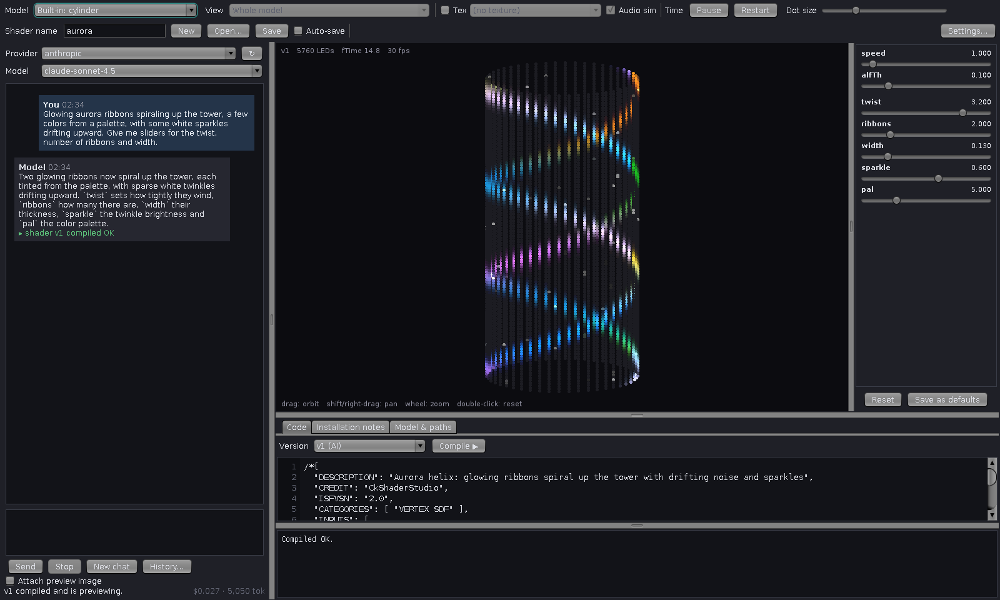

#  CkShaderStudio

An AI-assisted editor for [CkVShader](https://github.com/tracyscott/CkVShader) LED shaders, with a live
preview of your Chromatik model. Describe a shader in the chat, watch it run on your LEDs, then refine it by
chatting, moving sliders or editing the code. Shaders are saved as `.vtx` files that load straight into
the CkVShader and CkVShaderTex patterns in [Chromatik](https://chromatik.co).



## Features

- **Chat to iterate** with any model on [OpenRouter](https://openrouter.ai). Each reply is compiled and
  previewed; compile errors are sent back to the model automatically.
- **Faithful preview**: shaders run the same way CkVShader runs them (GLSL 330 vertex shaders with
  transform feedback, `#include <file.vti>`, ISF sliders, alpha threshold, textures and audio in Tex mode).
- **Your real model**: open any Chromatik `.lxm` file and preview per view, or use a built-in panel,
  cylinder or cube.
- **Versions and history**: every reply and hand edit is a version you can go back to, and **History…**
  lets you continue an earlier shader later with the whole conversation as context.

## Requirements

- Java 21 and Maven 3
- An OpenRouter API key
- Chromatik with the CkVShader package installed (to use the shaders you make)

## Build and run

```sh
git clone https://github.com/tracyscott/CkShaderStudio.git
cd CkShaderStudio
./run.sh
```

`run.sh` builds the app with Maven the first time (and whenever the source changes) and starts it. You can
also build and run it yourself:

```sh
mvn package
java -jar target/ckshaderstudio-0.1.0-jar-with-dependencies.jar
```

The build uses `com.heronarts:lx:1.1.0` (the LX library that ships with Chromatik 1.1) and JOGL
2.4.0-rc-20230123 from the JogAmp Maven repository, the same versions CkVShader uses.

## Using it

1. Click **Settings…** and paste your OpenRouter API key (or set `OPENROUTER_API_KEY` before starting).
2. Pick a model from the **Model** menu: *Open model file (.lxm)…* for your installation, or a built-in one.
   Choose a **View** if the model has several fixtures.
3. Type a **Shader name**, choose a provider and model in the chat panel, describe what you want and
   press **Send** (⌘/Ctrl+Enter).
4. Keep refining: chat, move the sliders (**Save as defaults** writes them into the shader), or edit the
   code and press **Compile ▶**.
5. Press **Save** (⌘/Ctrl+S). In Chromatik, open the shader with the CkVShader pattern's open button, or
   press its reload button if it is already loaded.

Enable **Tex** to write shaders for CkVShaderTex, which can sample an image and live audio.
`examples/aurora.vtx` is the shader in the screenshot.

## Where things are stored

| What | Where |
| --- | --- |
| Saved shaders | `~/Chromatik/Data/CkVShader/shaders/<name>.vtx` |
| Chat history and versions | `~/Chromatik/CkShaderStudio/sessions/<name>.json` |
| Settings, including the API key | `~/Chromatik/CkShaderStudio/settings.json` |

Folders can be changed in **Settings…**.

## License

MIT. See [LICENSE](LICENSE).
